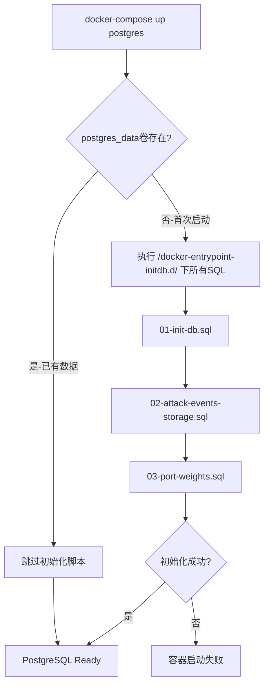

# 启动逻辑和数据库初始化完整梳理

## 🎯 执行摘要

**当前状态**: ❌ **数据库初始化存在严重风险**

**关键发现**: 所有持久化业务数据表都使用了`DROP TABLE IF EXISTS`,在特定场景下会导致历史数据永久丢失。

**安全检查结果**:
```bash
$ ./scripts/tools/check_db_init_safety.sh

🔴 严重问题 (Critical): 4个
⚠️  警告 (Warning):     多个
✓ 安全模式 (Safe):      少量

❌ 安全等级: 危险 (DANGEROUS)
```

---

## 📊 问题详细分析

### 核心矛盾

| 表类型 | 表名 | 当前策略 | 正确策略 | 风险级别 |
|--------|------|---------|---------|----------|
| **持久化表** | `attack_events` | `DROP TABLE` → `CREATE TABLE` | `CREATE TABLE IF NOT EXISTS` | 🔴 **严重** |
| **持久化表** | `threat_alerts` | `DROP TABLE` → `CREATE TABLE` | `CREATE TABLE IF NOT EXISTS` | 🔴 **严重** |
| **持久化表** | `threat_assessments` | `DROP TABLE` → `CREATE TABLE` | `CREATE TABLE IF NOT EXISTS` | 🔴 **严重** |
| **持久化表** | `device_status_history` | `DROP TABLE` → `CREATE TABLE` | `CREATE TABLE IF NOT EXISTS` | 🔴 **严重** |
| **配置表** | `device_customer_mapping` | `DROP TABLE` + `ON CONFLICT` | ✅ 正确 | ✅ 安全 |
| **配置表** | `port_risk_configs` | `DROP TABLE` + `ON CONFLICT` | ✅ 正确 | ✅ 安全 |

### 触发数据丢失的场景

#### 场景1: 开发者重建环境 (概率: **高**)
```bash
# 开发者想清理测试数据重新测试
docker-compose down -v          # ❌ 删除postgres_data卷
docker-compose up -d             # ✅ 重新执行初始化脚本
# 结果: ❌ 所有历史数据被 DROP TABLE 清空!
```

**影响**: 
- ❌ 1000+ 攻击事件记录丢失
- ❌ 数百条威胁告警丢失  
- ❌ 设备状态历史丢失
- ❌ 审计追溯链断裂

#### 场景2: 生产环境升级 (概率: **中**)
```bash
# 运维人员升级系统
docker volume rm threat-detection-system_postgres_data  # ❌ 意外删除数据卷
docker-compose up -d
# 结果: ❌ 生产数据全部丢失!
```

#### 场景3: Docker自动清理 (概率: **低**)
```bash
# Docker自动清理未使用的卷
docker system prune -a --volumes  # ❌ 误操作
# 结果: ❌ 如果容器未运行,数据卷被清理
```

---

## 🔍 启动流程详解

### PostgreSQL容器初始化逻辑



**关键点**:
1. **只在首次创建数据卷时**执行初始化脚本
2. **已有数据时不会执行**任何初始化脚本
3. **如果数据卷被删除**,重新执行初始化脚本

### 当前初始化脚本执行序列

| 脚本 | 执行顺序 | 关键操作 | 风险点 |
|------|---------|---------|--------|
| `01-init-db.sql` | 1 | `DROP TABLE IF EXISTS device_customer_mapping`<br>`DROP TABLE IF EXISTS threat_assessments`<br>`DROP TABLE IF EXISTS device_status_history` | ⚠️ threat_assessments被DROP<br>⚠️ device_status_history被DROP |
| `02-attack-events-storage.sql` | 2 | `DROP TABLE IF EXISTS attack_events`<br>`DROP TABLE IF EXISTS threat_alerts` | 🔴 **attack_events被DROP**<br>🔴 **threat_alerts被DROP** |
| `port_weights_migration.sql` | 3 | `DROP TABLE IF EXISTS port_risk_configs`<br>`INSERT ... ON CONFLICT` | ✅ 配置表,安全 |

---

## ✅ 解决方案

### 立即修复 (优先级: P0)

#### 修复1: 持久化表改为IF NOT EXISTS

**修改 `docker/02-attack-events-storage.sql`**:

```sql
-- ❌ 危险的当前写法
DROP TABLE IF EXISTS attack_events CASCADE;
CREATE TABLE attack_events (...);

-- ✅ 安全的修正写法
CREATE TABLE IF NOT EXISTS attack_events (
    id BIGINT GENERATED ALWAYS AS IDENTITY PRIMARY KEY,
    customer_id VARCHAR(100) NOT NULL,
    dev_serial VARCHAR(50) NOT NULL,
    attack_mac VARCHAR(17) NOT NULL,
    attack_ip VARCHAR(45),
    response_ip VARCHAR(45) NOT NULL,
    response_port INTEGER NOT NULL,
    event_timestamp TIMESTAMP WITH TIME ZONE NOT NULL,
    log_time BIGINT,
    received_at TIMESTAMP WITH TIME ZONE DEFAULT CURRENT_TIMESTAMP,
    raw_log_data JSONB,
    created_at TIMESTAMP WITH TIME ZONE DEFAULT CURRENT_TIMESTAMP
);

-- ✅ 索引也使用IF NOT EXISTS
CREATE INDEX IF NOT EXISTS idx_attack_events_customer ON attack_events(customer_id);
CREATE INDEX IF NOT EXISTS idx_attack_events_attack_mac ON attack_events(attack_mac);
-- ... 其他索引
```

同样修改:
- `threat_alerts`
- `threat_assessments`  
- `device_status_history`

#### 修复2: 配置表保持现状 (已是最佳实践)

配置表可以继续使用`DROP TABLE + INSERT ... ON CONFLICT`:

```sql
-- ✅ 配置表正确写法 (当前已是这样)
DROP TABLE IF EXISTS device_customer_mapping CASCADE;
CREATE TABLE device_customer_mapping (...);

INSERT INTO device_customer_mapping (...) VALUES (...)
ON CONFLICT (dev_serial) DO NOTHING;  -- 幂等性保证
```

#### 修复3: 视图和触发器幂等性

```sql
-- ✅ 视图幂等性
CREATE OR REPLACE VIEW v_recent_alerts AS
SELECT ... FROM threat_alerts ...;

-- ✅ 触发器幂等性
DROP TRIGGER IF EXISTS trigger_check_device_expiration ON device_status_history;
CREATE TRIGGER trigger_check_device_expiration ...;

-- ✅ 函数幂等性
CREATE OR REPLACE FUNCTION check_device_expiration()
RETURNS TRIGGER AS $$ ... $$ LANGUAGE plpgsql;
```

### 中期优化 (优先级: P1)

#### 重组SQL文件结构

建议的文件结构:
```
docker/docker-entrypoint-initdb.d/
├── 01-schema-persistent.sql     ← 持久化表 (CREATE IF NOT EXISTS)
├── 02-schema-config.sql         ← 配置表 (DROP + CREATE)
├── 03-config-data.sql           ← 配置数据 (INSERT ... ON CONFLICT)
├── 04-functions-triggers.sql    ← 函数触发器 (CREATE OR REPLACE)
└── 05-views.sql                 ← 视图 (CREATE OR REPLACE)
```

参考示例: `docker/01-schema-persistent.sql.example`

### 长期规划 (优先级: P2)

1. **引入数据库迁移工具**: Flyway 或 Liquibase
2. **实施自动备份**: 定时备份到外部存储
3. **数据分区**: 历史数据按月分区
4. **监控告警**: 数据异常自动告警

---

## 🛡️ 安全操作指南

### ✅ 安全的操作

```bash
# 1. 只重启服务 (推荐)
docker-compose restart

# 2. 停止并重新启动 (安全)
docker-compose down
docker-compose up -d

# 3. 重建服务但保留数据 (安全)
docker-compose build --no-cache data-ingestion
docker-compose up -d --force-recreate data-ingestion
```

### ⚠️ 谨慎操作 (需要备份)

```bash
# 删除数据卷前务必备份!
./scripts/tools/backup_database.sh

# 然后才能删除
docker volume rm threat-detection-system_postgres_data
```

### ❌ 危险操作 (仅在明确需要时)

```bash
# ❌ 会删除所有数据!
docker-compose down -v

# 务必先执行:
./scripts/tools/backup_database.sh
```

---

## 📋 实施检查清单

### 本次必须完成 (P0)

- [ ] **修改02-attack-events-storage.sql**: `attack_events` 和 `threat_alerts` 改为 `CREATE IF NOT EXISTS`
- [ ] **修改01-init-db.sql**: `threat_assessments` 和 `device_status_history` 改为 `CREATE IF NOT EXISTS`
- [ ] **验证幂等性**: 重复执行初始化脚本,确认无副作用
- [ ] **更新README.md**: 添加数据安全警告

### 本周完成 (P1)

- [ ] 创建备份脚本: `scripts/tools/backup_database.sh`
- [ ] 创建恢复脚本: `scripts/tools/restore_database.sh`
- [ ] 添加到CI/CD: 自动运行安全检查脚本
- [ ] 更新操作文档: 安全的启动/停止流程

### 下周计划 (P2)

- [ ] 重组SQL文件结构 (分离持久化表和配置表)
- [ ] 引入数据库版本管理工具
- [ ] 实施自动备份策略
- [ ] 添加数据完整性监控

---

## 📚 相关文档

| 文档 | 用途 | 链接 |
|------|------|------|
| 数据库初始化详解 | 完整技术分析 | [database_initialization_guide.md](./database_initialization_guide.md) |
| 启动稳定性改进 | 实施方案 | [startup_stability_improvements.md](./startup_stability_improvements.md) |
| 持久化表示例 | SQL模板 | [01-schema-persistent.sql.example](../docker/01-schema-persistent.sql.example) |
| 安全检查脚本 | 自动化检测 | [check_db_init_safety.sh](../scripts/tools/check_db_init_safety.sh) |

---

## 🔗 快速命令参考

```bash
# 运行安全检查
./scripts/tools/check_db_init_safety.sh

# 备份数据库 (TODO: 待创建)
./scripts/tools/backup_database.sh

# 恢复数据库 (TODO: 待创建)
./scripts/tools/restore_database.sh backups/xxx.sql.gz

# 查看当前数据量
docker exec -it postgres psql -U threat_user -d threat_detection -c "
SELECT 
    'attack_events' as table_name, COUNT(*) as count FROM attack_events
UNION ALL
SELECT 'threat_alerts', COUNT(*) FROM threat_alerts
UNION ALL
SELECT 'threat_assessments', COUNT(*) FROM threat_assessments
UNION ALL
SELECT 'device_status_history', COUNT(*) FROM device_status_history;
"
```

---

**最后更新**: 2025-01-15  
**负责人**: DevOps Team  
**紧急程度**: 🔴 **高 - 需立即修复**  
**预计修复时间**: 2小时
