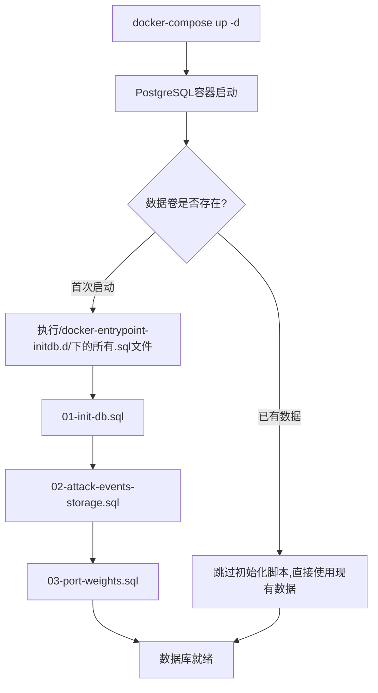

# 数据库初始化和启动逻辑详解

## 📋 目录
1. [当前问题总结](#当前问题总结)
2. [数据库初始化流程](#数据库初始化流程)
3. [潜在问题和解决方案](#潜在问题和解决方案)
4. [最佳实践建议](#最佳实践建议)
5. [故障排查指南](#故障排查指南)

---

## 当前问题总结

### ⚠️ 核心矛盾

我们的系统存在**两种不同性质的数据库表**，需要不同的初始化策略：

| 表类型 | 表名 | 数据性质 | 初始化策略 | 当前问题 |
|--------|------|---------|-----------|----------|
| **配置表** | `port_risk_configs`<br>`device_customer_mapping` | 静态配置数据<br>需要预加载 | **DROP + CREATE + INSERT**<br>每次重建保证一致性 | ✅ 正确处理 |
| **持久化表** | `attack_events`<br>`threat_alerts`<br>`threat_assessments`<br>`device_status_history` | 运行时产生的业务数据<br>需要保留历史 | **CREATE IF NOT EXISTS**<br>保留现有数据 | ❌ **被错误DROP掉** |

### 🔴 根本原因

**所有SQL初始化脚本都使用了 `DROP TABLE IF EXISTS`**，导致：
- ✅ **配置表**: 可以安全重建（数据可复现）
- ❌ **持久化表**: 丢失历史数据（**不可接受！**）

---

## 数据库初始化流程

### 1. Docker启动序列



#### 关键点
- **postgres_data卷**决定是否执行初始化脚本
- **只在首次创建卷时**执行 `/docker-entrypoint-initdb.d/` 下的SQL
- **已有数据时不会执行**任何初始化脚本

### 2. 当前初始化脚本执行顺序

| 脚本名 | 执行顺序 | 主要操作 | 当前策略 | 风险等级 |
|--------|---------|---------|---------|----------|
| **01-init-db.sql** | 第1个 | 配置表 + 持久化表 | `DROP TABLE IF EXISTS` | 🔴 **高风险** |
| **02-attack-events-storage.sql** | 第2个 | 持久化表 + 视图 | `DROP TABLE IF EXISTS` | 🔴 **高风险** |
| **03-port-weights.sql** | 第3个 | 配置表 + 数据 | `DROP TABLE IF EXISTS` → `INSERT ... ON CONFLICT` | ⚠️ 中等风险 |

### 3. 当前各表的创建逻辑

#### ✅ 配置表（安全）
```sql
-- device_customer_mapping (01-init-db.sql)
DROP TABLE IF EXISTS device_customer_mapping CASCADE;
CREATE TABLE device_customer_mapping (...);
INSERT INTO device_customer_mapping (...) VALUES (...) 
ON CONFLICT (dev_serial) DO NOTHING;  -- ✅ 幂等性保证

-- port_risk_configs (03-port-weights.sql)
DROP TABLE IF EXISTS port_risk_configs CASCADE;
CREATE TABLE IF NOT EXISTS port_risk_configs (...);
INSERT INTO port_risk_configs (...) VALUES (...)
ON CONFLICT (port_number) DO NOTHING;  -- ✅ 幂等性保证
```

**为什么安全？**
- 数据可以通过INSERT语句重新生成
- ON CONFLICT确保不会重复插入

#### ❌ 持久化表（危险！）
```sql
-- attack_events (02-attack-events-storage.sql)
DROP TABLE IF EXISTS attack_events CASCADE;  -- ❌ 删除所有历史数据!
CREATE TABLE attack_events (...);

-- threat_alerts (02-attack-events-storage.sql)
DROP TABLE IF EXISTS threat_alerts CASCADE;  -- ❌ 删除所有告警历史!
CREATE TABLE threat_alerts (...);

-- threat_assessments (01-init-db.sql)
DROP TABLE IF EXISTS threat_assessments CASCADE;  -- ❌ 删除所有评估记录!
CREATE TABLE threat_assessments (...);

-- device_status_history (01-init-db.sql)
DROP TABLE IF EXISTS device_status_history CASCADE;  -- ❌ 删除所有设备状态!
CREATE TABLE device_status_history (...);
```

**为什么危险？**
- 运行时产生的数据无法通过SQL重现
- 用户历史记录全部丢失
- 审计追溯链断裂

---

## 潜在问题和解决方案

### 问题1: 数据库表被意外重建

**场景**: 
```bash
# 用户想清理环境重新测试
docker-compose down -v  # ❌ 删除了postgres_data卷
docker-compose up -d     # ✅ 重新执行初始化脚本
```

**后果**:
- ✅ 配置表: 正常重建 + 数据恢复
- ❌ **持久化表: 所有历史数据丢失！**

**解决方案**:
```sql
-- 持久化表应该使用 CREATE IF NOT EXISTS (不要DROP)
CREATE TABLE IF NOT EXISTS attack_events (
    -- 表结构
) WITHOUT DROP;

-- 配置表可以继续使用 DROP + CREATE
DROP TABLE IF EXISTS device_customer_mapping CASCADE;
CREATE TABLE device_customer_mapping (...);
```

### 问题2: Hibernate ddl-auto 与数据库脚本冲突

**当前配置**:
```properties
# threat-assessment/application.properties
spring.jpa.hibernate.ddl-auto=none  ✅ 正确
```

**历史问题**:
```properties
# 曾经的错误配置
spring.jpa.hibernate.ddl-auto=update  ❌ 危险!
```

**为什么 `ddl-auto=update` 危险？**
1. Hibernate尝试修改表结构
2. 与现有视图(`v_recent_alerts`)冲突
3. 无法添加已存在的列
4. 报错: `ERROR: cannot drop column threat_score because other objects depend on it`

**最佳实践**:
```properties
# 生产环境: 完全禁用Hibernate DDL自动管理
spring.jpa.hibernate.ddl-auto=none

# 开发环境: 可以使用validate验证一致性
spring.jpa.hibernate.ddl-auto=validate
```

### 问题3: 初始化脚本幂等性不足

**当前问题**: 部分操作不幂等

```sql
-- ❌ 不幂等: 重复执行会失败
ALTER TABLE threat_assessments ADD COLUMN port_list TEXT;

-- ✅ 幂等: 重复执行安全
DO $$
BEGIN
    IF NOT EXISTS (
        SELECT 1 FROM information_schema.columns 
        WHERE table_name = 'threat_assessments' 
        AND column_name = 'port_list'
    ) THEN
        ALTER TABLE threat_assessments ADD COLUMN port_list TEXT;
    END IF;
END $$;
```

### 问题4: 视图依赖导致表无法修改

**场景**:
```sql
-- 创建视图
CREATE VIEW v_recent_alerts AS
SELECT threat_score, ... FROM threat_alerts;

-- 尝试修改表
ALTER TABLE threat_alerts DROP COLUMN threat_score;
-- ❌ ERROR: cannot drop column threat_score because view v_recent_alerts depends on it
```

**解决方案**:
```sql
-- 方案1: 先删除视图再重建
DROP VIEW IF EXISTS v_recent_alerts CASCADE;
ALTER TABLE threat_alerts ...;
CREATE VIEW v_recent_alerts AS ...;

-- 方案2: 使用 OR REPLACE (仅适用于不改变列签名的情况)
CREATE OR REPLACE VIEW v_recent_alerts AS ...;
```

---

## 最佳实践建议

### 🎯 推荐的初始化策略

#### 方案A: 分离配置和数据（推荐）

**文件结构**:
```
docker-entrypoint-initdb.d/
├── 01-schema-persistent.sql    # 持久化表结构 (CREATE IF NOT EXISTS)
├── 02-schema-config.sql        # 配置表结构 (DROP + CREATE)
├── 03-config-data.sql          # 配置数据 (INSERT ... ON CONFLICT)
├── 04-functions-triggers.sql   # 函数和触发器
└── 05-views.sql                # 视图定义
```

**01-schema-persistent.sql** (持久化表):
```sql
-- ============================================
-- 持久化业务数据表 - 保留历史记录
-- ============================================

-- 原始攻击事件存储
CREATE TABLE IF NOT EXISTS attack_events (
    id BIGINT GENERATED ALWAYS AS IDENTITY PRIMARY KEY,
    customer_id VARCHAR(100) NOT NULL,
    dev_serial VARCHAR(50) NOT NULL,
    attack_mac VARCHAR(17) NOT NULL,
    attack_ip VARCHAR(45),
    response_ip VARCHAR(45) NOT NULL,
    response_port INTEGER NOT NULL,
    event_timestamp TIMESTAMP WITH TIME ZONE NOT NULL,
    log_time BIGINT,
    received_at TIMESTAMP WITH TIME ZONE DEFAULT CURRENT_TIMESTAMP,
    raw_log_data JSONB,
    created_at TIMESTAMP WITH TIME ZONE DEFAULT CURRENT_TIMESTAMP
);

-- 威胁告警历史
CREATE TABLE IF NOT EXISTS threat_alerts (
    id BIGINT GENERATED ALWAYS AS IDENTITY PRIMARY KEY,
    customer_id VARCHAR(100) NOT NULL,
    attack_mac VARCHAR(17) NOT NULL,
    threat_score DECIMAL(12,2) NOT NULL,
    threat_level VARCHAR(20) NOT NULL,
    attack_count INTEGER NOT NULL,
    unique_ips INTEGER NOT NULL,
    unique_ports INTEGER NOT NULL,
    unique_devices INTEGER NOT NULL,
    mixed_port_weight DECIMAL(10,2),
    tier INTEGER NOT NULL,
    window_type VARCHAR(50),
    window_start TIMESTAMP WITH TIME ZONE NOT NULL,
    window_end TIMESTAMP WITH TIME ZONE NOT NULL,
    alert_timestamp TIMESTAMP WITH TIME ZONE NOT NULL,
    created_at TIMESTAMP WITH TIME ZONE DEFAULT CURRENT_TIMESTAMP,
    status VARCHAR(20) DEFAULT 'NEW',
    reviewed_by VARCHAR(100),
    reviewed_at TIMESTAMP WITH TIME ZONE,
    notes TEXT,
    raw_alert_data JSONB
);

-- 威胁评估记录
CREATE TABLE IF NOT EXISTS threat_assessments (
    id BIGINT GENERATED ALWAYS AS IDENTITY PRIMARY KEY,
    customer_id VARCHAR(100) NOT NULL,
    attack_mac VARCHAR(17) NOT NULL,
    threat_score DECIMAL(12,2) NOT NULL,
    threat_level VARCHAR(20) NOT NULL,
    attack_count INTEGER NOT NULL DEFAULT 0,
    unique_ips INTEGER NOT NULL DEFAULT 0,
    unique_ports INTEGER NOT NULL DEFAULT 0,
    unique_devices INTEGER NOT NULL DEFAULT 0,
    assessment_time TIMESTAMP WITH TIME ZONE NOT NULL,
    created_at TIMESTAMP WITH TIME ZONE DEFAULT CURRENT_TIMESTAMP,
    port_list TEXT,
    port_risk_score DECIMAL(10,2) DEFAULT 0.0,
    detection_tier INTEGER DEFAULT 2
);

-- 设备状态历史
CREATE TABLE IF NOT EXISTS device_status_history (
    id BIGINT GENERATED ALWAYS AS IDENTITY PRIMARY KEY,
    dev_serial VARCHAR(50) NOT NULL,
    customer_id VARCHAR(100) NOT NULL,
    sentry_count INTEGER NOT NULL,
    real_host_count INTEGER NOT NULL,
    dev_start_time BIGINT NOT NULL,
    dev_end_time BIGINT NOT NULL,
    report_time TIMESTAMP NOT NULL,
    created_at TIMESTAMP WITH TIME ZONE DEFAULT CURRENT_TIMESTAMP,
    is_healthy BOOLEAN DEFAULT true,
    is_expiring_soon BOOLEAN DEFAULT false,
    is_expired BOOLEAN DEFAULT false,
    sentry_count_changed BOOLEAN DEFAULT false,
    real_host_count_changed BOOLEAN DEFAULT false,
    raw_log TEXT
);

-- 索引创建 (使用 IF NOT EXISTS)
CREATE INDEX IF NOT EXISTS idx_attack_events_customer ON attack_events(customer_id);
CREATE INDEX IF NOT EXISTS idx_attack_events_attack_mac ON attack_events(attack_mac);
CREATE INDEX IF NOT EXISTS idx_attack_events_timestamp ON attack_events(event_timestamp DESC);
-- ... 其他索引
```

**02-schema-config.sql** (配置表):
```sql
-- ============================================
-- 配置数据表 - 可以安全重建
-- ============================================

-- 设备-客户映射表 (配置数据,可重建)
DROP TABLE IF EXISTS device_customer_mapping CASCADE;
CREATE TABLE device_customer_mapping (
    id BIGINT GENERATED ALWAYS AS IDENTITY PRIMARY KEY,
    dev_serial VARCHAR(50) NOT NULL UNIQUE,
    customer_id VARCHAR(100) NOT NULL,
    created_at TIMESTAMP WITH TIME ZONE DEFAULT CURRENT_TIMESTAMP,
    updated_at TIMESTAMP WITH TIME ZONE DEFAULT CURRENT_TIMESTAMP,
    is_active BOOLEAN DEFAULT true,
    description TEXT
);

-- 端口风险配置表 (配置数据,可重建)
DROP TABLE IF EXISTS port_risk_configs CASCADE;
CREATE TABLE port_risk_configs (
    id SERIAL PRIMARY KEY,
    port_number INTEGER NOT NULL UNIQUE,
    port_name VARCHAR(100) NOT NULL,
    risk_level VARCHAR(20) NOT NULL DEFAULT 'MEDIUM',
    risk_weight DECIMAL(4,2) NOT NULL DEFAULT 1.0,
    attack_intent VARCHAR(200),
    config_source VARCHAR(20) DEFAULT 'LEGACY',
    enabled BOOLEAN DEFAULT TRUE,
    description TEXT,
    created_at TIMESTAMP DEFAULT CURRENT_TIMESTAMP,
    updated_at TIMESTAMP DEFAULT CURRENT_TIMESTAMP
);
```

**03-config-data.sql** (配置数据):
```sql
-- ============================================
-- 配置数据插入 - 幂等性保证
-- ============================================

-- 设备映射数据
INSERT INTO device_customer_mapping (dev_serial, customer_id, description) VALUES
('10221e5a3be0cf2d', 'customer_a', 'Customer A - Device 1'),
('eebe4c42df504ea5', 'customer_a', 'Customer A - Device 2')
-- ...
ON CONFLICT (dev_serial) DO NOTHING;

-- 端口权重配置
INSERT INTO port_risk_configs (port_number, port_name, risk_level, risk_weight, attack_intent, config_source, description) VALUES
(22, 'SSH', 'CRITICAL', 10.0, 'SSH远程控制', 'CVSS', 'SSH远程登录服务'),
(23, 'Telnet', 'CRITICAL', 10.0, 'Telnet远程控制', 'CVSS', 'Telnet远程登录服务')
-- ...
ON CONFLICT (port_number) DO NOTHING;
```

**04-functions-triggers.sql** (函数和触发器):
```sql
-- ============================================
-- 数据库函数和触发器
-- ============================================

-- 更新时间戳函数
CREATE OR REPLACE FUNCTION update_updated_at_column()
RETURNS TRIGGER AS $$
BEGIN
    NEW.updated_at = CURRENT_TIMESTAMP;
    RETURN NEW;
END;
$$ language 'plpgsql';

-- 设备到期检测函数
CREATE OR REPLACE FUNCTION check_device_expiration()
RETURNS TRIGGER AS $$
DECLARE
    current_epoch BIGINT;
    days_until_expiry NUMERIC;
BEGIN
    current_epoch := EXTRACT(EPOCH FROM CURRENT_TIMESTAMP)::BIGINT;
    
    IF NEW.dev_end_time = -1 THEN
        NEW.is_expired := false;
        NEW.is_expiring_soon := false;
    ELSE
        IF NEW.dev_end_time < current_epoch THEN
            NEW.is_expired := true;
            NEW.is_expiring_soon := false;
        ELSE
            days_until_expiry := (NEW.dev_end_time - current_epoch) / 86400.0;
            IF days_until_expiry <= 7 THEN
                NEW.is_expiring_soon := true;
            ELSE
                NEW.is_expiring_soon := false;
            END IF;
            NEW.is_expired := false;
        END IF;
    END IF;
    
    RETURN NEW;
END;
$$ LANGUAGE plpgsql;

-- 触发器 (使用 DROP TRIGGER IF EXISTS 确保幂等)
DROP TRIGGER IF EXISTS trigger_check_device_expiration ON device_status_history;
CREATE TRIGGER trigger_check_device_expiration
    BEFORE INSERT OR UPDATE ON device_status_history
    FOR EACH ROW EXECUTE FUNCTION check_device_expiration();

DROP TRIGGER IF EXISTS update_device_customer_mapping_updated_at ON device_customer_mapping;
CREATE TRIGGER update_device_customer_mapping_updated_at
    BEFORE UPDATE ON device_customer_mapping
    FOR EACH ROW EXECUTE FUNCTION update_updated_at_column();
```

**05-views.sql** (视图):
```sql
-- ============================================
-- 查询视图
-- ============================================

-- 设备最新状态视图
CREATE OR REPLACE VIEW device_latest_status AS
SELECT DISTINCT ON (dev_serial)
    dev_serial,
    customer_id,
    sentry_count,
    real_host_count,
    dev_start_time,
    dev_end_time,
    report_time,
    is_healthy,
    is_expiring_soon,
    is_expired,
    created_at
FROM device_status_history
ORDER BY dev_serial, report_time DESC;

-- 最新告警视图
CREATE OR REPLACE VIEW v_recent_alerts AS
SELECT 
    ta.id,
    ta.customer_id,
    ta.attack_mac,
    ta.threat_score,
    ta.threat_level,
    ta.attack_count,
    ta.unique_ips,
    ta.unique_ports,
    ta.tier,
    ta.window_type,
    ta.alert_timestamp,
    ta.status,
    (SELECT MIN(event_timestamp) 
     FROM attack_events ae 
     WHERE ae.customer_id = ta.customer_id 
       AND ae.attack_mac = ta.attack_mac 
       AND ae.event_timestamp >= ta.window_start 
       AND ae.event_timestamp < ta.window_end
    ) as first_attack_time,
    (SELECT COUNT(*) 
     FROM attack_events ae 
     WHERE ae.customer_id = ta.customer_id 
       AND ae.attack_mac = ta.attack_mac 
       AND ae.event_timestamp >= ta.window_start 
       AND ae.event_timestamp < ta.window_end
    ) as total_events
FROM threat_alerts ta
WHERE ta.alert_timestamp >= NOW() - INTERVAL '7 days'
ORDER BY ta.alert_timestamp DESC;

-- 客户告警汇总视图
CREATE OR REPLACE VIEW v_customer_alert_summary AS
SELECT 
    customer_id,
    COUNT(*) as total_alerts,
    COUNT(DISTINCT attack_mac) as unique_attackers,
    SUM(CASE WHEN threat_level = 'CRITICAL' THEN 1 ELSE 0 END) as critical_alerts,
    SUM(CASE WHEN threat_level = 'HIGH' THEN 1 ELSE 0 END) as high_alerts,
    SUM(CASE WHEN threat_level = 'MEDIUM' THEN 1 ELSE 0 END) as medium_alerts,
    SUM(CASE WHEN threat_level = 'LOW' THEN 1 ELSE 0 END) as low_alerts,
    MAX(alert_timestamp) as last_alert_time,
    COUNT(CASE WHEN status = 'NEW' THEN 1 END) as pending_review
FROM threat_alerts
WHERE alert_timestamp >= NOW() - INTERVAL '30 days'
GROUP BY customer_id;

-- 授予权限
GRANT SELECT ON ALL TABLES IN SCHEMA public TO threat_user;
GRANT USAGE, SELECT ON ALL SEQUENCES IN SCHEMA public TO threat_user;
```

#### 方案B: 添加数据迁移脚本

**新增文件**: `docker/00-check-and-migrate.sql`

```sql
-- ============================================
-- 数据库迁移和向后兼容脚本
-- ============================================

DO $$
DECLARE
    table_exists BOOLEAN;
BEGIN
    -- 检查attack_events表是否存在
    SELECT EXISTS (
        SELECT FROM information_schema.tables 
        WHERE table_name = 'attack_events'
    ) INTO table_exists;
    
    IF table_exists THEN
        RAISE NOTICE 'attack_events表已存在,跳过创建';
        
        -- 只添加缺失的列 (向后兼容)
        IF NOT EXISTS (
            SELECT 1 FROM information_schema.columns 
            WHERE table_name = 'attack_events' 
            AND column_name = 'raw_log_data'
        ) THEN
            RAISE NOTICE '添加raw_log_data列';
            ALTER TABLE attack_events ADD COLUMN raw_log_data JSONB;
        END IF;
        
    ELSE
        RAISE NOTICE '创建attack_events表';
        -- 执行完整的CREATE TABLE语句
    END IF;
END $$;
```

---

## 故障排查指南

### 场景1: 数据丢失了怎么办？

**症状**:
```bash
# 查询历史数据
SELECT COUNT(*) FROM attack_events;
-- 返回: 0  (应该有成千上万条)

SELECT COUNT(*) FROM threat_alerts;
-- 返回: 0  (应该有数百条)
```

**原因分析**:
1. 执行了 `docker-compose down -v` 删除了数据卷
2. 重启后初始化脚本重建了空表

**预防措施**:
```bash
# ❌ 危险: 会删除所有数据
docker-compose down -v

# ✅ 安全: 保留数据卷
docker-compose down

# ✅ 只重启服务不重建容器
docker-compose restart

# ✅ 备份数据卷
docker run --rm -v threat-detection-system_postgres_data:/data -v $(pwd):/backup \
  busybox tar czf /backup/postgres-backup-$(date +%Y%m%d-%H%M%S).tar.gz /data
```

### 场景2: 表结构和JPA实体不匹配

**症状**:
```
Caused by: org.hibernate.tool.schema.spi.SchemaManagementException: 
Schema-validation: missing column [unique_devices] in table [threat_alerts]
```

**解决方法**:
```sql
-- 1. 连接数据库
docker exec -it postgres psql -U threat_user -d threat_detection

-- 2. 检查表结构
\d threat_alerts

-- 3. 添加缺失的列
ALTER TABLE threat_alerts ADD COLUMN unique_devices INTEGER NOT NULL DEFAULT 0;

-- 4. 退出
\q
```

### 场景3: 视图阻止表结构修改

**症状**:
```
ERROR: cannot drop column threat_score because other objects depend on it
DETAIL: view v_recent_alerts depends on column threat_score
```

**解决方法**:
```sql
-- 1. 删除依赖的视图
DROP VIEW IF EXISTS v_recent_alerts CASCADE;
DROP VIEW IF EXISTS v_customer_alert_summary CASCADE;

-- 2. 修改表结构
ALTER TABLE threat_alerts ...;

-- 3. 重建视图
CREATE OR REPLACE VIEW v_recent_alerts AS ...;
CREATE OR REPLACE VIEW v_customer_alert_summary AS ...;
```

### 场景4: 端口配置重复插入失败

**症状**:
```
ERROR: duplicate key value violates unique constraint "port_risk_configs_pkey"
DETAIL: Key (port_number)=(22) already exists.
```

**解决方法**:
```sql
-- 确保所有INSERT使用ON CONFLICT
INSERT INTO port_risk_configs (...) VALUES (...)
ON CONFLICT (port_number) DO NOTHING;  -- ✅ 幂等性

-- 或者使用 DO UPDATE
ON CONFLICT (port_number) DO UPDATE 
SET risk_weight = EXCLUDED.risk_weight;  -- 更新权重
```

---

## 📝 总结和行动计划

### 立即执行（高优先级）

1. **分离持久化表和配置表的初始化逻辑**
   ```bash
   # 重构文件
   01-schema-persistent.sql    # CREATE IF NOT EXISTS
   02-schema-config.sql        # DROP + CREATE
   03-config-data.sql          # INSERT ... ON CONFLICT
   04-functions-triggers.sql   # CREATE OR REPLACE
   05-views.sql                # CREATE OR REPLACE VIEW
   ```

2. **修改所有持久化表为CREATE IF NOT EXISTS**
   ```sql
   -- 替换
   DROP TABLE IF EXISTS attack_events CASCADE;
   CREATE TABLE attack_events (...);
   
   -- 为
   CREATE TABLE IF NOT EXISTS attack_events (...);
   ```

3. **添加数据备份脚本**
   ```bash
   # scripts/tools/backup_database.sh
   docker exec postgres pg_dump -U threat_user threat_detection > backup.sql
   ```

### 中期优化（中优先级）

4. **添加数据迁移机制**
   - 使用Flyway或Liquibase管理schema版本
   - 支持渐进式升级

5. **添加健康检查**
   ```sql
   -- 检查数据完整性
   SELECT 'attack_events' as table_name, COUNT(*) as record_count FROM attack_events
   UNION ALL
   SELECT 'threat_alerts', COUNT(*) FROM threat_alerts;
   ```

### 长期规划（低优先级）

6. **实现数据分区**
   ```sql
   -- 按月分区存储历史数据
   CREATE TABLE attack_events_2024_10 PARTITION OF attack_events
   FOR VALUES FROM ('2024-10-01') TO ('2024-11-01');
   ```

7. **添加数据归档策略**
   - 90天以上数据归档到冷存储
   - 保留热数据在主数据库

---

## 🔗 相关文档

- [Docker Compose配置](../docker/docker-compose.yml)
- [数据库初始化脚本](../docker/)
- [Hibernate配置](../services/threat-assessment/src/main/resources/application.properties)
- [完整开发计划](./complete_development_plan_2025.md)

---

**最后更新**: 2025-01-15  
**维护者**: Cloud-Native Threat Detection Team
