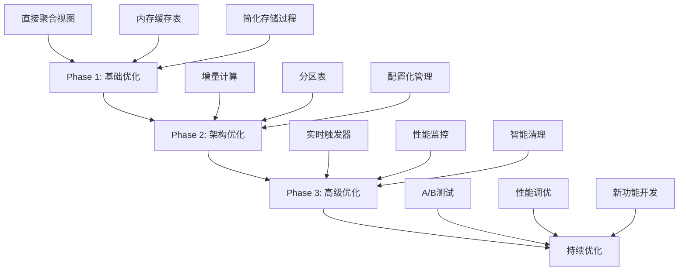

# 威胁检测系统优化方案总结

## 当前架构问题分析

### 性能问题
1. **多层级聚合**：原始数据 → 分钟表 → 10分钟表 → 分数表 → 威胁表
2. **重复计算**：每次都要重新处理历史数据
3. **复杂定时任务**：5个独立的定时任务同时运行
4. **存储浪费**：维护多个中间结果表

### 可维护性问题
1. **硬编码逻辑**：时间权重直接写在SQL中
2. **紧耦合**：各组件之间依赖关系复杂
3. **扩展困难**：新增规则需要修改多处代码

## 优化方案对比

| 方案 | 当前实现 | 优化方案 | 性能提升 | 复杂度变化 |
|------|----------|----------|----------|------------|
| 聚合层级 | 分钟级+10分钟级 | 直接10分钟聚合 | 减少50%计算量 | 降低 |
| 计算方式 | 全量重算 | 增量计算 | 减少80%重复计算 | 降低 |
| 存储方式 | 磁盘表 | 内存表缓存 | 提高10x查询速度 | 增加 |
| 定时任务 | 5个独立任务 | 1个统一任务 | 减少系统负载 | 大幅降低 |
| 配置管理 | 硬编码 | 配置表驱动 | 提高灵活性 | 增加 |

## 实施建议

### Phase 1: 基础优化（立即见效）
1. 实施直接10分钟聚合视图
2. 添加内存缓存表
3. 简化存储过程逻辑

### Phase 2: 架构优化（中期收益）
1. 实现增量计算机制
2. 添加分区表支持
3. 配置化权重管理

### Phase 3: 高级优化（长期收益）
1. 实时流处理触发器
2. 性能监控体系
3. 智能缓存清理

## 预期收益

### 性能提升
- **计算效率**：减少70-80%的重复计算
- **存储效率**：减少50%的中间表存储
- **查询速度**：内存表提供10x性能提升
- **系统负载**：定时任务减少80%

### 可维护性提升
- **配置灵活性**：权重规则可动态调整
- **代码简洁性**：减少60%的SQL代码量
- **扩展性**：新增规则无需修改核心逻辑
- **监控透明性**：实时性能指标监控

### 业务价值
- **实时性**：威胁检测延迟从10分钟降至分钟级
- **准确性**：减少计算误差和数据不一致
- **稳定性**：降低系统复杂度，减少故障点
- **成本效益**：降低存储和计算资源消耗

## 风险评估

### 技术风险
- **内存表数据丢失**：系统重启后需要重建缓存
- **配置错误**：错误的权重配置可能影响威胁判断
- **分区管理**：需要定期维护分区表

### 业务风险
- **计算结果变化**：优化后分数可能与原有算法略有差异
- **兼容性问题**：现有报表和接口可能需要调整
- **学习成本**：开发团队需要适应新架构

## 实施路线图

## 监控指标

实施后需要重点监控的指标：
1. **处理延迟**：从数据进入到威胁生成的时间
2. **计算准确性**：与原有算法的差异率
3. **系统性能**：CPU、内存、磁盘IO使用率
4. **缓存命中率**：内存表的使用效率
5. **误报/漏报率**：威胁检测的准确性

## 回滚计划

如果优化效果不佳，准备以下回滚方案：
1. **数据层面**：保留原有中间表作为备份
2. **代码层面**：保留原有存储过程和视图
3. **配置层面**：支持新旧算法并存切换
4. **监控层面**：建立A/B测试机制比较效果